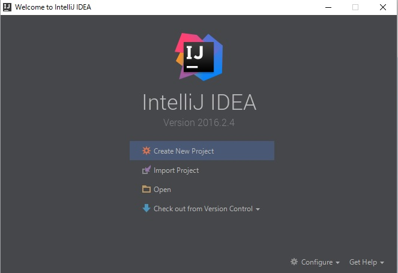
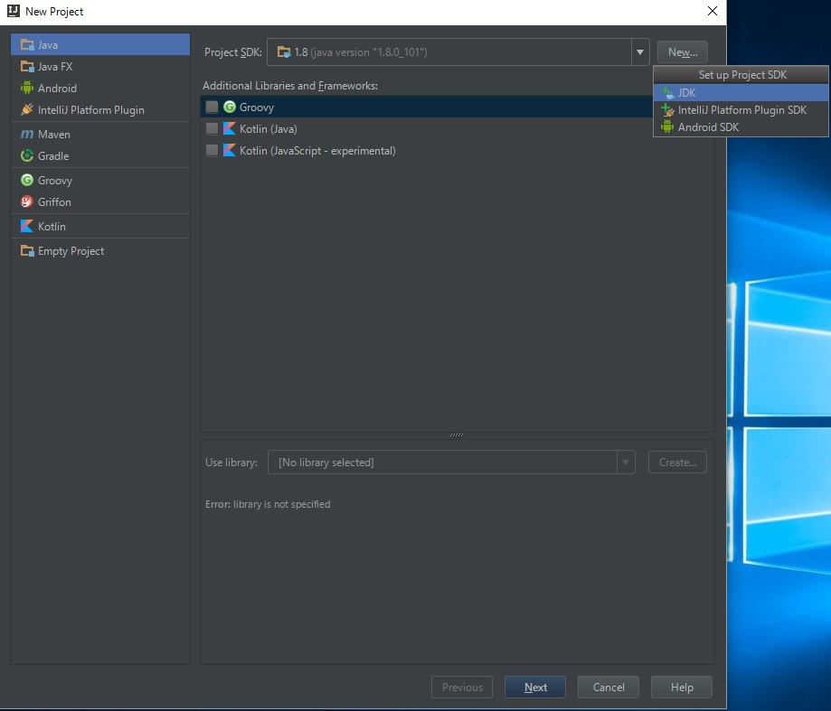
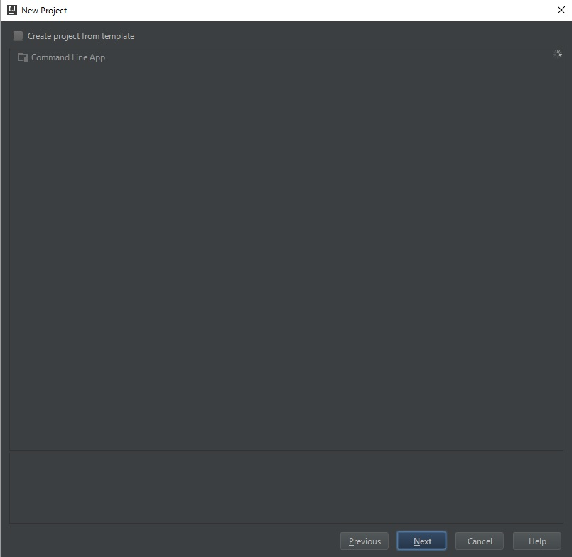
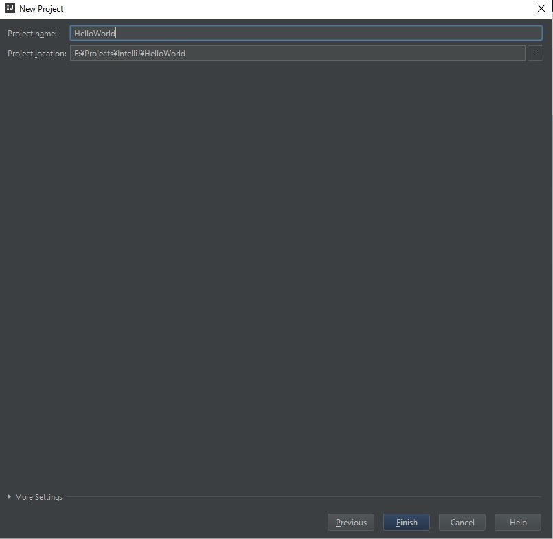
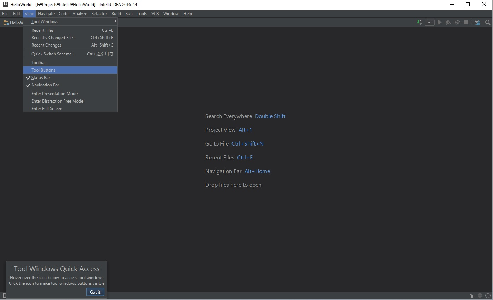
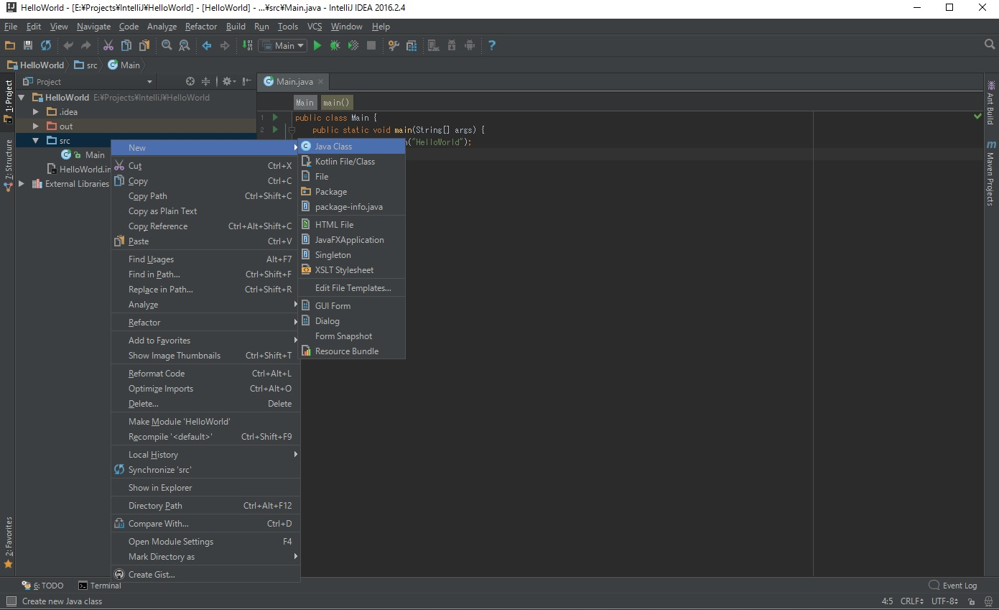
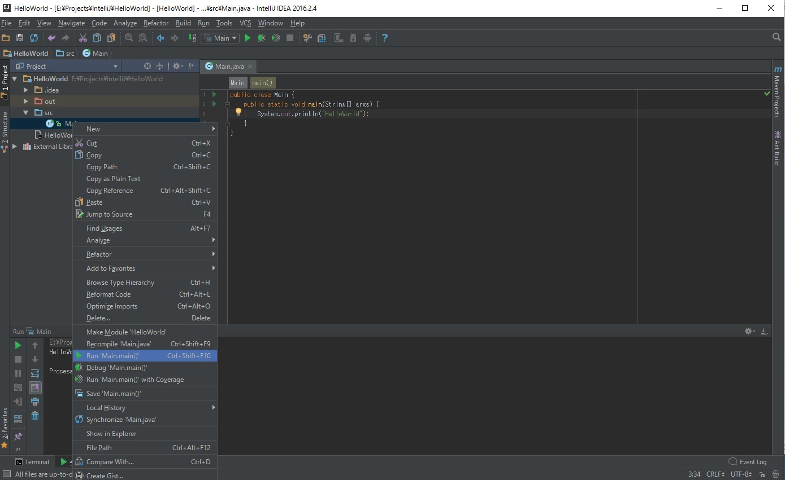

# New Project
最初にプロジェクトを作成してください。  
「Create New Project」を押せば作成できます。

# Project SDK
次に下図の画面が出てくると思います。  
そこからはじめにProject SDK Pathの設定をします。  
Project SDKの右隣りの「New」ボタンを押すと選択肢が出てくるのでJDKを選択し、JDKのパスを設定してください。

# Templete
何もせずに「Next」を押す。

# Project Name
Projectの名前と保存先を決め、「Finish」を押してください。

# Tool Buttons
これでIntelliJの初期画面です。このままだとショートカットからしか、ProjectViewなどにアクセスできないので、上のメニューの「View」から「Toolbar」と「ToolButtons」を選択して有効化してください。

# Project View
左側に現れた「1:Project」をクリックすると左側に下図のような画面になります。  
まずは「src」を右クリックし、「New > Java Class」を押してJava Classを作成し、適当な処理を書いてください。

# Run
処理がかけたら最後に先ほど作成したクラスを右クリックし、「Run 'Main.main()'」をくりっくしてプログラムを起動してください。  
無事起動できたら終了です。  

