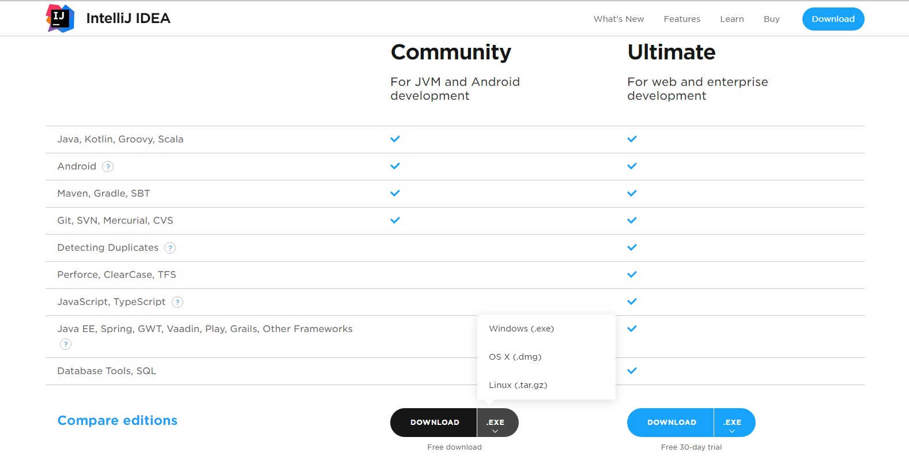
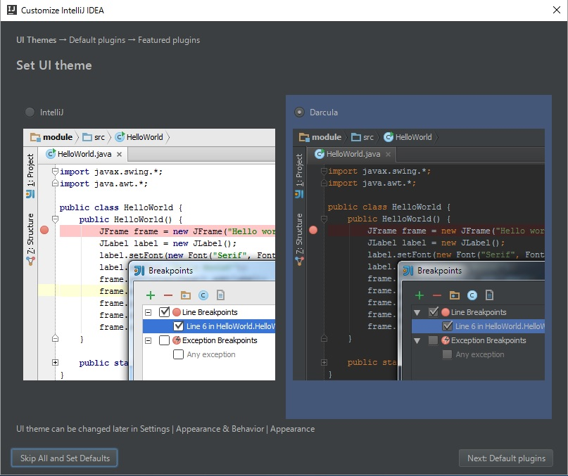
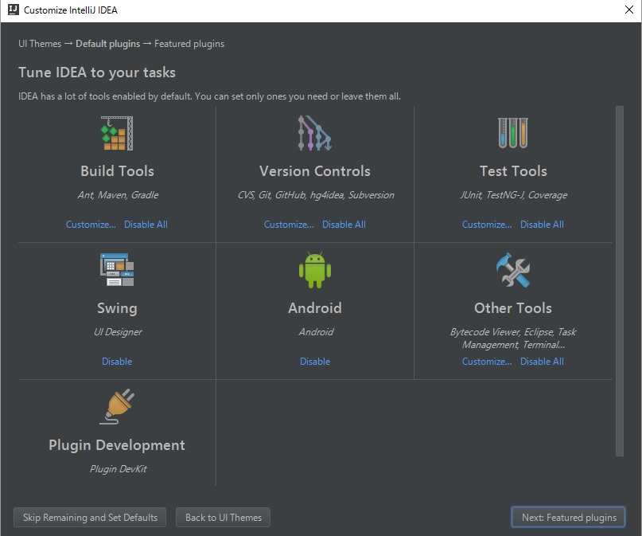
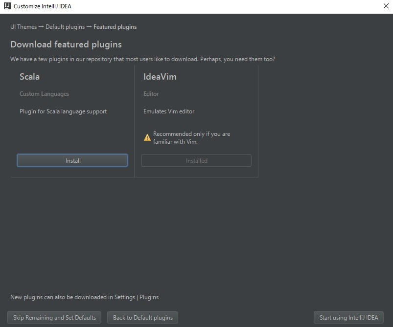

# Download
[公式サイト](https://www.jetbrains.com/idea/#chooseYourEdition)から以下の画像のようにOSを選択してダウンロードしてください。  
※ 基本的にサイトにアクセスした際に勝手に最適なものが選択されているのでDOWNLOADボタンを押すだけでいけます。  

また、ネットワークが重くて全くダウンロード出来ない場合はUSBで直接渡すので教えて下さい。

# Install
ダウンロードしたファイルを起動してインストールをしてください。 
基本的にダイアログの指示に従っていれば問題なくインストールできます。
どうしてもインストール出来ない場合は、[参考サイト](http://qiita.com/syu_chan_1005/items/46f94412f7493d6e60eb)があるので見ながらやるか、副手をよんでください。

# Setup
インストールができたら、IntelliJ IDEAを起動して最初のセットアップを行ってください。  
自分の好みでセットアップして大丈夫です。

## 1
UIを選択します。見たとおり、白ベースか黒ベースの2種類があるので好きな方でOK  

## 2
デフォルトプラグインの設定です。  
最初は以下の項目は全て有効になっているのでいらないのがあれば無効にしてくだい。もちろんそのままでも大丈夫です。  

## 3
次もプラグインの設定ですが、こちらはデフォルトが無効になっているプラグインです。  
こちらも好きに設定してもらって大丈夫です。

これでセットアップが完了しました。 
右下の「Start using IntelliJ IDEA」をクリックしてIntelliJを起動してください。

# Next
[Hello World](./intellij_helloworld.md)

